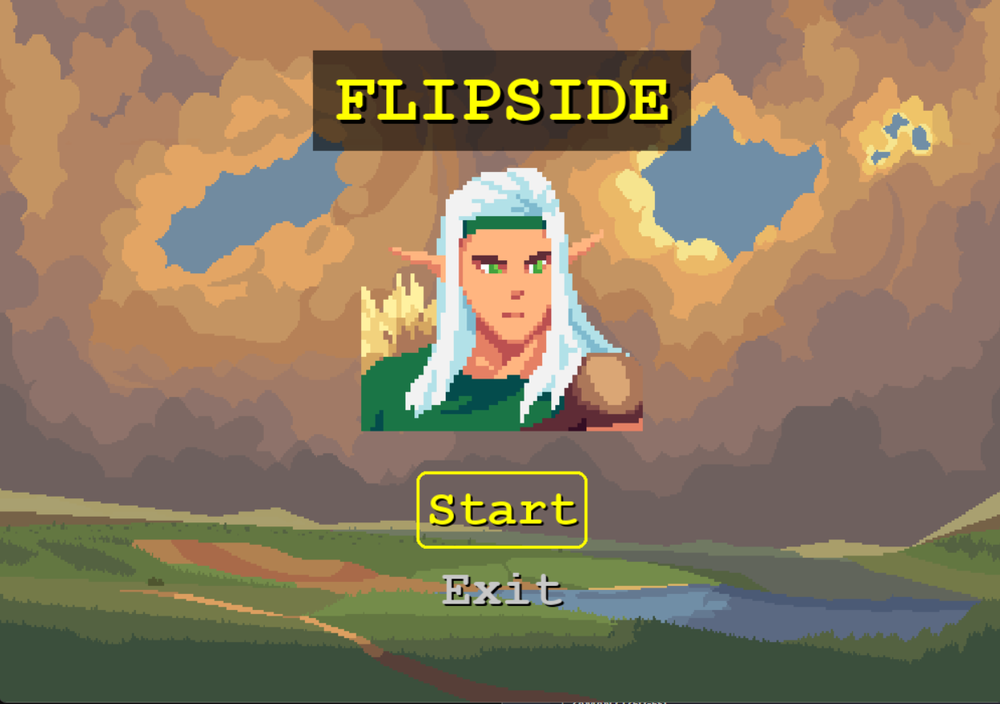
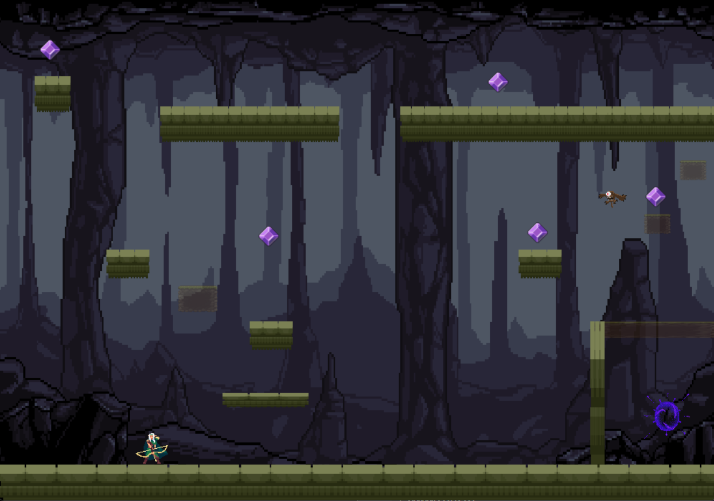
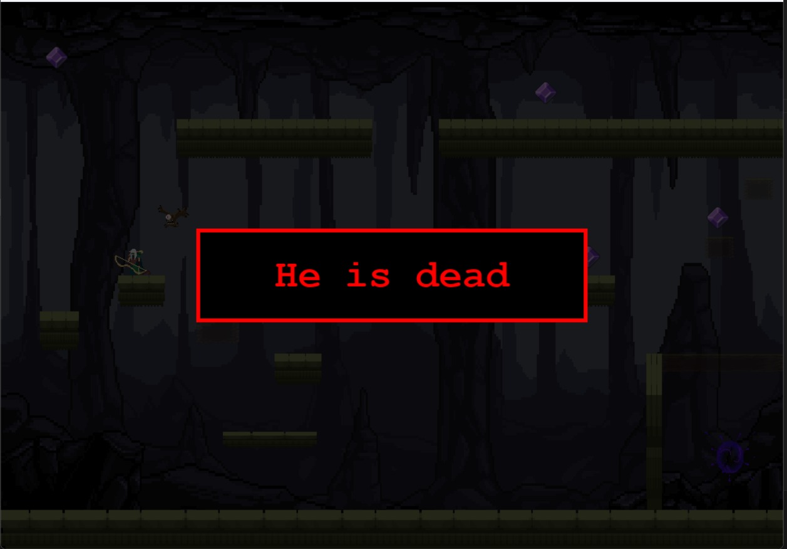
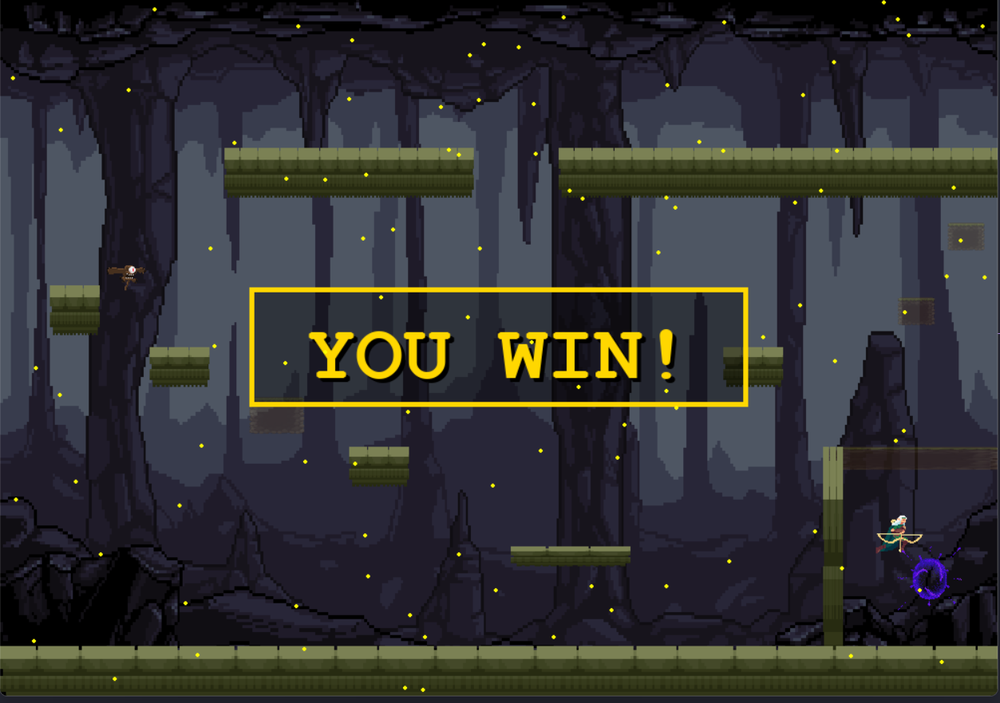

# Oyun-Projesi

#  Flipside 🎮 | 2D Platform Oyunu
Bu proje , Python ve Pygame kullanılarak geliştirilmiş basit bir 2D platform oyunudur. Oyunda karakterler, evren geçişi, hareketli platformlar ,düşmanlar ve toplanabilir taşlar gibi dinamik özellikler yer almaktadır.

## 🎮 Özellikler
- 🧍 Oyuncu karakteri
- 🛸 Uçan düşman karakteri
- 🌍 İki farklı evren arasında geçiş
- 🎯 Toplanabilir taşlar (gem)
- 🪜 Hareketli platformlar (yatay ve dikey)
- 🚪 Animasyonlu çıkış kapısı
- 💀 Ölüm ve kazanma ekranları
- 🕹️ Menü arayüzü (Başlat / Çıkış)

## 📁 Dosya Yapısı
| Dosya / Klasör                        | Açıklama                                          |
| ------------------------------------- | ------------------------------------------------- |
| main.py                             | Oyunun başlatıldığı ana dosya.                    |
| game.py                             | Oyun döngüsünü ve genel kontrolleri içerir.       |
| level.py                            | Seviye tasarımı ve geçişleri yönetir.             |
| player.py                           | Oyuncu karakteri sınıfı ve hareketleri.           |
| animation_loader.py                 | Animasyon yüklemeleri için yardımcı fonksiyonlar. |
| Background.png / Background_2.png | Farklı arka plan görselleri.                      |
| Evren_1.png / Evren2.png          | Seviye arka planları readme için.                  |
| Platform.PNG / Platform_2.PNG     | Platform grafikleri.                              |
| karakter.PNG                        | Oyuncu karakter görseli menü için.                          |
| gem.PNG                             | Toplanabilir eşya grafiği.                        |
| Flight.png                          | Düşman grafiği.                                   |
| Baslangic_ekrani.png                | Başlangıç ekranı görseli readme için.                         |
| animations/                         | Animasyon görselleri ve dosyaları.                |

# 📷 Görseller

!
#[Evren1](Evren_1.png)




## 📦 Başlangıç
Bu proje, Python dilinde geliştirilmiştir. Oyunu çalıştırabilmek için aşağıdaki adımları takip edebilirsiniz.

### Gereksinimler
- Python 3.6+
- Pygame Kütüphanesi

### Kurulum

1. *Python'ı yükleyin*: Eğer Python yüklü değilse, [Python Resmi Web Sitesi](https://www.python.org/downloads/) üzerinden Python'u indirip kurun.
   
2. *Gerekli Kütüphaneleri Yükleyin*: Terminal veya komut satırına şu komutu girin:
   bash
   pip install pygame

3. **Proje Dosyalarını indirin**: Bu projeyi indirip bilgisayarınızda çalıştırabilirsiniz:
   bash
   git clone https://github.com/Zuhre-23/Oyun-Projesi.git
   cd Oyun-Projesi

4. *Oyunu Çalıştırın*
   ```bash
   python main.py

## 🎮 Oynanış
Oyun, ana karakterin farklı seviyelerde düşmanları ve engelleri aşarak ilerlemesini konu alır. Her seviyede, zorluk artar ve yeni özellikler eklenir.

### Ana Menü
Ana menüde yeni oyun başlatabilir, devam edebilir veya seçenekler menüsüne erişebilirsiniz.

### Oynayış
Oyunun amacı, karakterinizle engelleri ve düşmanları aşarak bölümleri tamamlamak ve çıkış kapısına ulaşmaktır.

+ Yön tuşları ile hareket edebilirsiniz.

+ Zıplama ↑ tuşu ile yapılır.

+ Evren geçişleri boşluk tuşu ile yapılır.

### 👥 Katkıda Bulunanlar
- [Zühre Özen](mailto:ozenzuhre63@gmail.com)
- [Aynur Altıntaş](mailto:aynuraltintas00@gmail.com)
- [Damla Yeni](mailto:dyeni22@posta.pau.edu.tr)

### 📌 Notlar
> ⚠ Oyun geliştirme süreci hâlâ devam etmektedir.

> ⚠ Yeni seviyeler ve karakter animasyonları eklenmesi planlanmaktadır.

### 📫 İletişim
Herhangi bir öneri veya katkı için iletişime geçebilirsin:
* 📧[ozenzuhre63@gmail.com](ozenzuhre63@gmail.com)
* 📧[dyeni22@posta.pau.edu.tr](dyeni22@posta.pau.edu.tr)
* 📧[aynuraltintas00@gmail.com](aynuraltintas00@gmail.com)